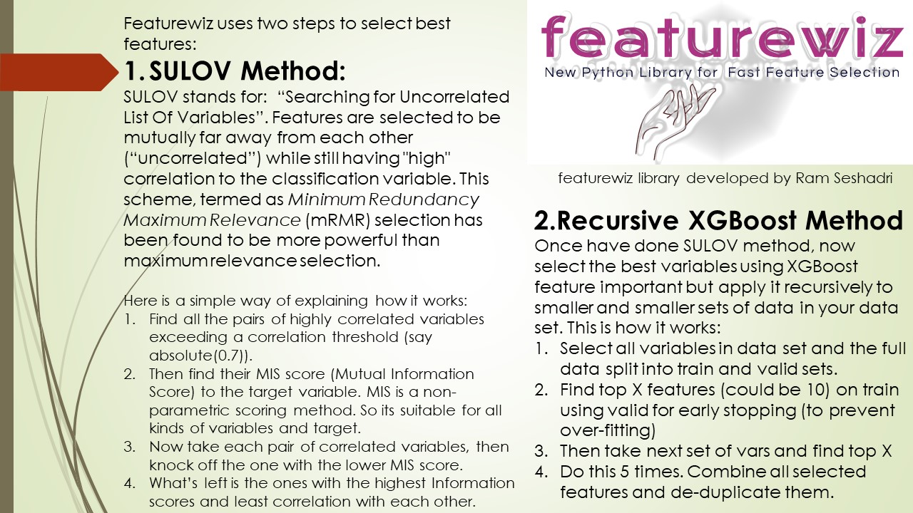

# featurewiz


<p>
Update (Nov 9, 2021): Featurewiz now upgraded with Dask for blazing fast performance even for very large data sets! 
<p>
`CAUTION`: You must restart the kernel after installing featurewiz in Kaggle and Colab notebooks for Scikitlearn and DASK libraries to take effect. Otherwise you will get an error that some libraries are not found. You don't have to do anything to activate dask: featurewiz automatically uses dask_xgboost_flag = True as the default. You can turn off dask by setting that flag to False.
<p>
Featurewiz a new python library for creating and selecting the best features in your data set fast!
featurewiz accomplishes this in 2 steps:
<p>The first step is optional and it is about creating new features.<p>
1. <b>Performing Feature Engineering</b>: One of the gaps in open source AutoML tools and especially Auto_ViML has been the lack of feature engineering capabilities that high powered competitions like Kaggle required. The ability to create "interaction" variables or adding "group-by" features or "target-encoding" categorical variables was difficult and sifting through those hundreds of new features was painstaking and left only to "experts". Now there is some good news.<br>
featurewiz now enables you to add hundreds of such features at the click of a code. Set the "feature_engg" flag to "interactions", "groupby" or "target" and featurewiz will select the best encoders for each of those options and create hundreds (perhaps thousands) of features in one go.<br> Not only that, it will use SULOV method and Recursive XGBoost to sift through those variables and find only the least correlated and most important features among them. All in one step!.<br>
<p>The second step is Feature Selection:<br>
2. <b>Executing Feature Selection</b>: Once you have created 100's of new features, you still have two problems left to solve:
1. How do we interpret those newly created features?
2. Which of these features is important and which are useless? How many of them are highly correlated to each other causing redundancy?
3. Does the model overfit now on these new features and perform better or worse than before?
<br>
All are very important questions and you must be very careful using this feature_engg option in featurewiz. Otherwise, you can create a "garbage in, garbage out" problem. Caveat Emptor!


<br>featurewiz uses the SULOV method and Recursive XGBoost to reduce features in order to select the best features for the model. Here is how.<br>
<p><b>SULOV</b>: SULOV stands for `Searching for Uncorrelated List of Variables`. The SULOV method is similar to the Minimum-redundancy-maximum-relevance (mRMR) <a href="https://en.wikipedia.org/wiki/Feature_selection#Minimum-redundancy-maximum-relevance_(mRMR)_feature_selection">algorithm explained in wikipedia</a> as one of the best feature selection methods. The SULOV algorithm is explained in this chart below.
Here is a simple way of explaining how it works:
<ol>
<li>Find all the pairs of highly correlated variables exceeding a correlation threshold (say absolute(0.7)).
<li>Then find their MIS score (Mutual Information Score) to the target variable. MIS is a non-parametric scoring method. So its suitable for all kinds of variables and target.
<li>Now take each pair of correlated variables, then knock off the one with the lower MIS score.
<li>What’s left is the ones with the highest Information scores and least correlation with each other.
</ol>


3. <b>Recursive XGBoost</b>: Once SULOV has selected variables that have high mutual information scores with least less correlation amongst them, we use XGBoost to repeatedly find best features among the remaining variables after SULOV. The Recursive XGBoost method is explained in this chart below.
Here is how it works:
<ol>
<li>Select all variables in data set and the full data split into train and valid sets.
<li>Find top X features (could be 10) on train using valid for early stopping (to prevent over-fitting)
<li>Then take next set of vars and find top X
<li>Do this 5 times. Combine all selected features and de-duplicate them.
</ol>


4. <b>Building the simplest and most "interpretable" model</b>: featurewiz represents the "next best" step you must perform after doing feature engineering  since you might have added some highly correlated or even useless features when you use automated feature engineering. featurewiz ensures you have the least number of features needed to build a high performing or equivalent model.

<b>A WORD OF CAUTION:</b> Just because you can, doesn't mean you should. Make sure you understand feature engineered variables before you attempt to build your model any further. featurewiz displays the SULOV chart which can show you how the 100's of newly created variables added to your dataset are highly correlated to each other and were removed. This will help you understand how feature selection works in featurewiz.
<br>
<p>To upgrade to the best, most stable and full-featured version always do the following: <br>
<code>Use $ pip install featurewiz --upgrade --ignore-installed</code><br>
or
<code>pip install git+https://github.com/AutoViML/featurewiz.git </code><br>

`CAUTION`: You must restart the kernel in Kaggle and Colab notebooks after installing featurewiz since the latest scikit-learn and dask libraries won't take effect unless you restart the kernel.

## Table of Contents
<ul>
<li><a href="#background">Background</a></li>
<li><a href="#install">Install</a></li>
<li><a href="#usage">Usage</a></li>
<li><a href="#api">API</a></li>
<li><a href="#maintainers">Maintainers</a></li>
<li><a href="#contributing">Contributing</a></li>
<li><a href="#license">License</a></li>
</ul>

## Background



To learn more about how featurewiz works under the hood, watch this [video](https://www.youtube.com/embed/ZiNutwPcAU0)<br>

<p>featurewiz was designed for selecting High Performance variables with the fewest steps.

In most cases, featurewiz builds models with 20%-99% fewer features than your original data set with nearly the same or slightly lower performance (this is based on my trials. Your experience may vary).<br>
<p>
featurewiz is every Data Scientist's feature wizard that will:<ol>
<li><b>Automatically pre-process data</b>: you can send in your entire dataframe "as is" and featurewiz will classify and change/label encode categorical variables changes to help XGBoost processing. It classifies variables as numeric or categorical or NLP or date-time variables automatically so it can use them correctly to model.<br>
<li><b>Perform feature engineering automatically</b>: The ability to create "interaction" variables or adding "group-by" features or "target-encoding" categorical variables is difficult and sifting through those hundreds of new features is painstaking and left only to "experts". Now, with featurewiz you can create hundreds or even thousands of new features with the click of a mouse. This is very helpful when you have a small number of features to start with. However, be careful with this option. You can very easily create a monster with this option.
<li><b>Perform feature reduction automatically</b>. When you have small data sets and you know your domain well, it is easy to perhaps do EDA and identify which variables are important. But when you have a very large data set with hundreds if not thousands of variables, selecting the best features from your model can mean the difference between a bloated and highly complex model or a simple model with the fewest and most information-rich features. featurewiz uses XGBoost repeatedly to perform feature selection. You must try it on your large data sets and compare!<br>
<li><b>Explain SULOV method graphically </b> using networkx library so you can see which variables are highly correlated to which ones and which of those have high or low mutual information scores automatically. Just set verbose = 2 to see the graph. <br>
</ol>

<b>***  Notes of Gratitude ***</b>:<br>
<ol>
<li><b>featurewiz is built using xgboost, numpy, pandas and matplotlib</b>. It should run on most Python 3 Anaconda installations. You won't have to import any special libraries other than "XGBoost" and "networkx" library. </li>
<li><b>We use "networkx" library for charts and interpretability</b>. <br>But if you don't have these libraries, featurewiz will install those for you automatically.</li>
<li><b>Alex Lekov</b> (https://github.com/Alex-Lekov/AutoML_Alex/tree/master/automl_alex) for his DataBunch and encoders modules which are used by the tool (although with some modifications).</li>
<li><b>Category Encoders</b> library in Python : This is an amazing library. Make sure you read all about the encoders that featurewiz uses here: https://contrib.scikit-learn.org/category_encoders/index.html </li>
</ol>

## Install

**Prerequsites:**

- [Anaconda](https://docs.anaconda.com/anaconda/install/)

To clone featurewiz, it is better to create a new environment, and install the required dependencies:

To install from PyPi:

```
conda create -n <your_env_name> python=3.7 anaconda
conda activate <your_env_name> # ON WINDOWS: `source activate <your_env_name>`
pip install featurewiz
or
pip install git+https://github.com/AutoViML/featurewiz.git
```

To install from source:

```
cd <featurewiz_Destination>
git clone git@github.com:AutoViML/featurewiz.git
# or download and unzip https://github.com/AutoViML/featurewiz/archive/master.zip
conda create -n <your_env_name> python=3.7 anaconda
conda activate <your_env_name> # ON WINDOWS: `source activate <your_env_name>`
cd featurewiz
pip install -r requirements.txt
```

## Usage

In the same directory, open a Jupyter Notebook and use this line to import the .py file:

```
from featurewiz import featurewiz
```

Load a data set (any CSV or text file) into a Pandas dataframe and give it the name of the target(s) variable. If you have more than one target, it will handle multi-label targets too. Just give it a list of variables in that case. If you don't have a dataframe, you can simply enter the name and path of the file to load into featurewiz:

```
outputs = featurewiz(dataname, target, corr_limit=0.70, verbose=2, sep=',', 
		header=0, test_data='',feature_engg='', category_encoders='',
		dask_xgboost_flag=True, nrows=None)
```

`outputs`: There will always be multiple objects in output. The objects in that tuple can vary:
1. "features" and "train": It be a list (of selected features) and one dataframe (if you sent in train only)
2. "trainm" and "testm": It can be two dataframes when you send in both test and train but with selected features.

Both the selected features and dataframes are ready for you to now to do further modeling.<br>
featurewiz works on any Multi-Class, Multi-Label Data Set. So you can have as many target labels as you want.<br>
You don't have to tell featurewiz whether it is a Regression or Classification problem. It will decide that automatically.

## API

**Arguments**

- `dataname`: could be a datapath+filename or a dataframe. It will detect whether your input is a filename or a dataframe and load it automatically.
- `target`: name of the target variable in the data set.
- `corr_limit`: if you want to set your own threshold for removing variables as highly correlated, then give it here. The default is 0.7 which means variables less than -0.7 and greater than 0.7 in pearson's correlation will be candidates for removal.
- `verbose`: This has 3 possible states:
  - `0` limited output. Great for running this silently and getting fast results.
  - `1` more verbiage. Great for knowing how results were and making changes to flags in input.
  - `2` SULOV charts and output. Great for finding out what happens under the hood for SULOV method.
- `test_data`: If you want to transform test data in the same way you are transforming dataname, you can.
    test_data could be the name of a datapath+filename or a dataframe. featurewiz will detect whether
        your input is a filename or a dataframe and load it automatically. Default is empty string.
- `feature_engg`: You can let featurewiz select its best encoders for your data set by setting this flag
    for adding feature engineering. There are three choices. You can choose one, two or all three.
    - `interactions`: This will add interaction features to your data such as x1*x2, x2*x3, x1**2, x2**2, etc.
    - `groupby`: This will generate Group By features to your numeric vars by grouping all categorical vars.
    - `target`:  This will encode and transform all your categorical features using certain target encoders.<br>
    Default is empty string (which means no additional features)
- `category_encoders`: Instead of above method, you can choose your own kind of category encoders from the list below.
    Recommend you do not use more than two of these. Featurewiz will automatically select only two from your list. Default is empty string (which means no encoding of your categorical features)<br> These descriptions are derived from the excellent <a href="https://contrib.scikit-learn.org/category_encoders/"> category_encoders</a> python library. Please check it out!
    - `HashingEncoder`: HashingEncoder is a multivariate hashing implementation with configurable dimensionality/precision. The advantage of this encoder is that it does not maintain a dictionary of observed categories. Consequently, the encoder does not grow in size and accepts new values during data scoring by design.
    - `SumEncoder`: SumEncoder is a Sum contrast coding for the encoding of categorical features.
    - `PolynomialEncoder`: PolynomialEncoder is a Polynomial contrast coding for the encoding of categorical features.
    - `BackwardDifferenceEncoder`: BackwardDifferenceEncoder is a Backward difference contrast coding for encoding categorical variables.
    - `OneHotEncoder`: OneHotEncoder is the traditional Onehot (or dummy) coding for categorical features. It produces one feature per category, each being a binary.
    - `HelmertEncoder`: HelmertEncoder uses the Helmert contrast coding for encoding categorical features.
    - `OrdinalEncoder`: OrdinalEncoder uses Ordinal encoding to designate a single column of integers to represent the categories in your data. Integers however start in the same order in which the categories are found in your dataset. If you want to change the order, just sort the column and send it in for encoding.
    - `FrequencyEncoder`: FrequencyEncoder is a count encoding technique for categorical features. For a given categorical feature, it replaces the names of the categories with the group counts of each category.
    - `BaseNEncoder`: BaseNEncoder encodes the categories into arrays of their base-N representation. A base of 1 is equivalent to one-hot encoding (not really base-1, but useful), a base of 2 is equivalent to binary encoding. N=number of actual categories is equivalent to vanilla ordinal encoding.
    - `TargetEncoder`: TargetEncoder performs Target encoding for categorical features. It supports following kinds of targets: binary and continuous. For multi-class targets it uses a PolynomialWrapper.
    - `CatBoostEncoder`: CatBoostEncoder performs CatBoost coding for categorical features. It supports the following kinds of targets: binary and continuous. For polynomial target support, it uses a PolynomialWrapper. This is very similar to leave-one-out encoding, but calculates the values “on-the-fly”. Consequently, the values naturally vary during the training phase and it is not necessary to add random noise.
    - `WOEEncoder`: WOEEncoder uses the Weight of Evidence technique for categorical features. It supports only one kind of target: binary. For polynomial target support, it uses a PolynomialWrapper. It cannot be used for Regression.
    - `JamesSteinEncoder`: JamesSteinEncoder uses the James-Stein estimator. It supports 2 kinds of targets: binary and continuous. For polynomial target support, it uses PolynomialWrapper.
    For feature value i, James-Stein estimator returns a weighted average of:
    The mean target value for the observed feature value i.
    The mean target value (regardless of the feature value).
    - `dask_xgboost_flag`: Default is True and uses dask_xgboost estimator. You can turn it off if it gives an error. Then it will use pandas and xgboost basic to do the job. It may be a little slower.
    - `nrows`: default `None`. You can set the number of rows to read from your datafile if it is too large to fit into either dask or pandas. But you won't have to if you use dask. 
**Return values**
-   `outputs`: Output is always a tuple. We can call our outputs in that tuple: out1 and out2.
    -   `out1` and `out2`: If you sent in just one dataframe or filename as input, you will get:
        - 1. `features`: It will be a list (of selected features) and
        - 2. `trainm`: It will be a dataframe (if you sent in a file or dataname as input)
    -   `out1` and `out2`: If you sent in two files or dataframes (train and test), you will get:
        - 1. `trainm`: a modified train dataframe with engineered and selected features from dataname and
        - 2. `testm`: a modified test dataframe with engineered and selected features from test_data.

## Maintainers

* [@AutoViML](https://github.com/AutoViML)

## Contributing

See [the contributing file](CONTRIBUTING.md)!

PRs accepted.

## License

Apache License 2.0 © 2020 Ram Seshadri

## DISCLAIMER
This project is not an official Google project. It is not supported by Google and Google specifically disclaims all warranties as to its quality, merchantability, or fitness for a particular purpose.
