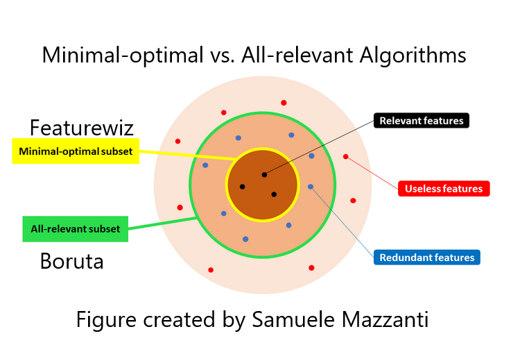

# featurewiz
`featurewiz` is a powerful feature selection library that has a number of features that make it stand out from the competition, including:
<ol>
<li>It provides one of the best automatic feature selection algorithms (Minimum Redundancy Maximum Relevance (MRMR)) described by wikipedia as: <a href="https://en.wikipedia.org/wiki/Minimum_redundancy_feature_selection">"The MRMR selection has been found to be more powerful than the maximum relevance feature selection"</a> such as Boruta.</li>
<li>It selects the best number of un-correlated features that have maximum mutual information about the target without having to specify the number of features</li>
<li>It is fast and easy to use, and comes with a number of helpful features, such as a built-in categorical-to-numeric encoder and a powerful feature engineering module</li>
<li>It is well-documented, and it comes with a number of <a href="https://github.com/AutoViML/featurewiz/tree/main/examples">examples</a>.</li>
<li>It is actively maintained, and it is regularly updated with new features and bug fixes.</li>
</ol>
If you are looking for a single feature selection library, we would definitely recommend checking out featurewiz. It is a powerful tool that can help you to improve the performance of your machine learning models.

# Table of Contents
<ul>
<li><a href="#introduction">What is featurewiz</a></li>
<li><a href="#working">How it works</a></li>
<li><a href="#tips">Tips for using featurewiz</a></li>
<li><a href="#install">How to install featurewiz</a></li>
<li><a href="#usage">Usage</a></li>
<li><a href="#api">API</a></li>
<li><a href="#additional">Additional Tips</a></li>
<li><a href="#maintainers">Maintainers</a></li>
<li><a href="#contributing">Contributing</a></li>
<li><a href="#license">License</a></li>
<li><a href="#disclaimer">Disclaimer</a></li>
</ul>
<p>


## Introduction
`featurewiz` a new python library for creating and selecting the best features in your data set fast!
`featurewiz` can be used in one or two ways. Both are explained below.

### 1.  Feature Engineering
<p>The first step is not absolutely necessary but it can be used to create new features that may or may not be helpful (be careful with automated feature engineering tools!).<p>
1. <b>Performing Feature Engineering</b>: One of the gaps in open source AutoML tools and especially Auto_ViML has been the lack of feature engineering capabilities that high powered competitions such as Kaggle required. The ability to create "interaction" variables or adding "group-by" features or "target-encoding" categorical variables was difficult and sifting through those hundreds of new features to find best features was difficult and left only to "experts" or "professionals". featurewiz was created to help you in this endeavor.<br>
<p>featurewiz now enables you to add hundreds of such features with a single line of code. Set the "feature_engg" flag to "interactions", "groupby" or "target" and featurewiz will select the best encoders for each of those options and create hundreds (perhaps thousands) of features in one go. Not only that, using the next step, featurewiz will sift through numerous such variables and find only the least correlated and most relevant features to your model. All in one step!.<br>


### 2.  Feature Selection
<p>The second step is Feature Selection. `featurewiz` uses the MRMR (Minimum Redundancy Maximum Relevance) algorithm as the basis for its feature selection. <br>
<b> Why do Feature Selection</b>? Once you have created 100's of new features, you still have three questions left to answer:
1. How do we interpret those newly created features?
2. Which of these features is important and which are useless? How many of them are highly correlated to each other causing redundancy?
3. Does the model overfit now on these new features and perform better or worse than before?
<br>
All are very important questions and featurewiz answers them by using the SULOV method and Recursive XGBoost to reduce features in your dataset to the best "minimum optimal" features for the model.<br>
<p><b>SULOV</b>: SULOV stands for `Searching for Uncorrelated List of Variables`. The SULOV algorithm is based on the Minimum-Redundancy-Maximum-Relevance (MRMR) <a href="https://towardsdatascience.com/mrmr-explained-exactly-how-you-wished-someone-explained-to-you-9cf4ed27458b">algorithm explained in this article</a> as one of the best feature selection methods. To understand how MRMR works and how it is different from `Boruta` and other feature selection methods, see the chart below. Here "Minimal Optimal" refers to the MRMR and featurewiz kind of algorithms while "all-relevant" refers to Boruta kind of algorithms.<br>



## Working
`featurewiz` performs feature selection in 2 steps. Each step is explained below.
<b>The working of the `SULOV` algorithm</b> is as follows:
<ol>
<li>Find all the pairs of highly correlated variables exceeding a correlation threshold (say absolute(0.7)).</li>
<li>Then find their MIS score (Mutual Information Score) to the target variable. MIS is a non-parametric scoring method. So its suitable for all kinds of variables and target.</li>
<li>Now take each pair of correlated variables, then knock off the one with the lower MIS score.</li>
<li>What’s left is the ones with the highest Information scores and least correlation with each other.</li>
</ol>


<b>The working of the Recursive XGBoost</b> is as follows: 
Once SULOV has selected variables that have high mutual information scores with least less correlation amongst them, featurewiz uses XGBoost to repeatedly find the best features among the remaining variables after SULOV. 
<ol>
<li>Select all variables in data set and the full data split into train and valid sets.</li>
<li>Find top X features (could be 10) on train using valid for early stopping (to prevent over-fitting)</li>
<li>Then take next set of vars and find top X</li>
<li>Do this 5 times. Combine all selected features and de-duplicate them.</li>
</ol>


## Tips
Here are some additional tips for ML engineers and data scientists when using featurewiz:
<ol>
<li><b>Always cross-validate your results</b>: When you use a feature selection tool, it is important to cross-validate your results. This means that you should split your data into a training set and a test set. Use the training set to select features, and then evaluate your model on the test set. This will help you to ensure that your model is not overfitting to the training data.</li>
<li><b>Use multiple feature selection tools</b>: It is a good idea to use multiple feature selection tools and compare the results. This will help you to get a better understanding of which features are most important for your data.</li>
<li><b>Don't forget to engineer new features</b>: Feature selection is only one part of the process of building a good machine learning model. You should also spend time engineering your features to make them as informative as possible. This can involve things like creating new features, transforming existing features, and removing irrelevant features.</li>
<li><b>Don't overfit your model</b>: It is important to avoid overfitting your model to the training data. Overfitting occurs when your model learns the noise in the training data, rather than the underlying signal. To avoid overfitting, you can use regularization techniques, such as lasso or elasticnet.</li>
<li><b>Start with a small number of features</b>: When you are first starting out, it is a good idea to start with a small number of features. This will help you to avoid overfitting your model. As you become more experienced, you can experiment with adding more features.</li>
</ol>

## Install

**Prerequsites:**
<ol>
<li><b>featurewiz is built using xgboost, dask, numpy, pandas and matplotlib</b>. It should run on most Python 3 Anaconda installations. You won't have to import any special libraries other than "dask", "XGBoost" and "networkx" library. Optionally, it uses LightGBM for fast modeling, which it installs automatically. </li>
<li><b>We use "networkx" library for charts and interpretability</b>. <br>But if you don't have these libraries, featurewiz will install those for you automatically.</li>
</ol>
To install from source:

```
cd <featurewiz_Destination>
git clone git@github.com:AutoViML/featurewiz.git
# or download and unzip https://github.com/AutoViML/featurewiz/archive/master.zip
conda create -n <your_env_name> python=3.7 anaconda
conda activate <your_env_name> # ON WINDOWS: `source activate <your_env_name>`
cd featurewiz
pip install -r requirements.txt
```

##  Good News: You can install featurewiz on Colab and Kaggle easily in 2 steps!
<a href="updates.md">Check out more latest updates from this page</a><br>
As of June 2022, thanks to [arturdaraujo](https://github.com/arturdaraujo), featurewiz is now available on conda-forge. You can try:<br>

```
 conda install -c conda-forge featurewiz
```

### If the above conda install fails, you can try installing featurewiz this way:
##Step 1: Install featurewiz first<br>

```
 !pip install featurewiz --ignore-installed --no-deps
 !pip install xlrd --ignore-installed --no-deps 
```

##Step 2: Next, install Pillow since Kaggle has an incompatible version. <br>

```
 !pip install Pillow==9.0.0
```

## Usage

For feature selection, you must use the newer syntax which is similar to the scikit-learn fit and predict transformer syntax below.

```
from featurewiz import FeatureWiz
fwiz = FeatureWiz(corr_limit=0.70, feature_engg='', category_encoders='', dask_xgboost_flag=False, nrows=None, verbose=2)
X_train_selected = fwiz.fit_transform(X_train, y_train)
X_test_selected = fwiz.transform(X_test)
### get list of selected features ###
fwiz.features  
```

Alternatively, you can use featurewiz for feature engineering using this older syntax. Otherwise, it will give an error. If you want to combine feature engg and then feature selection, you must use this older syntax:

```
import featurewiz as fwiz
outputs = fwiz.featurewiz(dataname=train, target=target, corr_limit=0.70, verbose=2, sep=',', 
		header=0, test_data='',feature_engg='', category_encoders='',
		dask_xgboost_flag=False, nrows=None)
```

`outputs`: There will always be multiple objects in output. The objects in that tuple can vary:
1. "features" and "trainm": It be a list (of selected features) and one dataframe (if you sent in train only)
2. "trainm" and "testm": It can be two dataframes when you send in both test and train but with selected features.
<ol>
<li>Both the selected features and dataframes are ready for you to now to do further modeling.
<li>Featurewiz works on any multi-class, multi-label data Set. So you can have as many target labels as you want.
<li>You don't have to tell Featurewiz whether it is a Regression or Classification problem. It will decide that automatically.
</ol>

## API

**Arguments**

- `dataname`: could be a datapath+filename or a dataframe. It will detect whether your input is a filename or a dataframe and load it automatically.
- `target`: name of the target variable in the data set.
- `corr_limit`: if you want to set your own threshold for removing variables as highly correlated, then give it here. The default is 0.7 which means variables less than -0.7 and greater than 0.7 in pearson's correlation will be candidates for removal.
- `verbose`: This has 3 possible states:
  - `0` limited output. Great for running this silently and getting fast results.
  - `1` more verbiage. Great for knowing how results were and making changes to flags in input.
  - `2` SULOV charts and output. Great for finding out what happens under the hood for SULOV method.
- `test_data`: If you want to transform test data in the same way you are transforming dataname, you can.
    test_data could be the name of a datapath+filename or a dataframe. featurewiz will detect whether
        your input is a filename or a dataframe and load it automatically. Default is empty string.
- `feature_engg`: You can let featurewiz select its best encoders for your data set by setting this flag
    for adding feature engineering. There are three choices. You can choose one, two or all three.
    - `interactions`: This will add interaction features to your data such as x1*x2, x2*x3, x1**2, x2**2, etc.
    - `groupby`: This will generate Group By features to your numeric vars by grouping all categorical vars.
    - `target`:  This will encode and transform all your categorical features using certain target encoders.<br>
    Default is empty string (which means no additional features)
- `category_encoders`: Instead of above method, you can choose your own kind of category encoders from the list below.
    Recommend you do not use more than two of these. Featurewiz will automatically select only two from your list. Default is empty string (which means no encoding of your categorical features)<br> These descriptions are derived from the excellent <a href="https://contrib.scikit-learn.org/category_encoders/"> category_encoders</a> python library. Please check it out!
    - `HashingEncoder`: HashingEncoder is a multivariate hashing implementation with configurable dimensionality/precision. The advantage of this encoder is that it does not maintain a dictionary of observed categories. Consequently, the encoder does not grow in size and accepts new values during data scoring by design.
    - `SumEncoder`: SumEncoder is a Sum contrast coding for the encoding of categorical features.
    - `PolynomialEncoder`: PolynomialEncoder is a Polynomial contrast coding for the encoding of categorical features.
    - `BackwardDifferenceEncoder`: BackwardDifferenceEncoder is a Backward difference contrast coding for encoding categorical variables.
    - `OneHotEncoder`: OneHotEncoder is the traditional Onehot (or dummy) coding for categorical features. It produces one feature per category, each being a binary.
    - `HelmertEncoder`: HelmertEncoder uses the Helmert contrast coding for encoding categorical features.
    - `OrdinalEncoder`: OrdinalEncoder uses Ordinal encoding to designate a single column of integers to represent the categories in your data. Integers however start in the same order in which the categories are found in your dataset. If you want to change the order, just sort the column and send it in for encoding.
    - `FrequencyEncoder`: FrequencyEncoder is a count encoding technique for categorical features. For a given categorical feature, it replaces the names of the categories with the group counts of each category.
    - `BaseNEncoder`: BaseNEncoder encodes the categories into arrays of their base-N representation. A base of 1 is equivalent to one-hot encoding (not really base-1, but useful), a base of 2 is equivalent to binary encoding. N=number of actual categories is equivalent to vanilla ordinal encoding.
    - `TargetEncoder`: TargetEncoder performs Target encoding for categorical features. It supports following kinds of targets: binary and continuous. For multi-class targets it uses a PolynomialWrapper.
    - `CatBoostEncoder`: CatBoostEncoder performs CatBoost coding for categorical features. It supports the following kinds of targets: binary and continuous. For polynomial target support, it uses a PolynomialWrapper. This is very similar to leave-one-out encoding, but calculates the values “on-the-fly”. Consequently, the values naturally vary during the training phase and it is not necessary to add random noise.
    - `WOEEncoder`: WOEEncoder uses the Weight of Evidence technique for categorical features. It supports only one kind of target: binary. For polynomial target support, it uses a PolynomialWrapper. It cannot be used for Regression.
    - `JamesSteinEncoder`: JamesSteinEncoder uses the James-Stein estimator. It supports 2 kinds of targets: binary and continuous. For polynomial target support, it uses PolynomialWrapper.
    For feature value i, James-Stein estimator returns a weighted average of:
    The mean target value for the observed feature value i.
    The mean target value (regardless of the feature value).
    - `dask_xgboost_flag`: Default is False. Set to True to use dask_xgboost estimator. You can turn it off if it gives an error. Then it will use pandas and regular xgboost to do the job.
    - `nrows`: default `None`. You can set the number of rows to read from your datafile if it is too large to fit into either dask or pandas. But you won't have to if you use dask. 

**Output values**
-   `outputs`: Output is always a tuple. We can call our outputs in that tuple: out1 and out2.
    -   `out1` and `out2`: If you sent in just one dataframe or filename as input, you will get:
        - 1. `features`: It will be a list (of selected features) and
        - 2. `trainm`: It will be a dataframe (if you sent in a file or dataname as input)
    -   `out1` and `out2`: If you sent in two files or dataframes (train and test), you will get:
        - 1. `trainm`: a modified train dataframe with engineered and selected features from dataname and
        - 2. `testm`: a modified test dataframe with engineered and selected features from test_data.

## Additional


To learn more about how featurewiz works under the hood, watch this [video](https://www.youtube.com/embed/ZiNutwPcAU0)<br>
<p>featurewiz was designed for selecting High Performance variables with the fewest steps.
In most cases, featurewiz builds models with 20%-99% fewer features than your original data set with nearly the same or slightly lower performance (this is based on my trials. Your experience may vary).<br>
<p>
featurewiz is every Data Scientist's feature wizard that will:<ol>
<li><b>Automatically pre-process data</b>: you can send in your entire dataframe "as is" and featurewiz will classify and change/label encode categorical variables changes to help XGBoost processing. It classifies variables as numeric or categorical or NLP or date-time variables automatically so it can use them correctly to model.<br>
<li><b>Perform feature engineering automatically</b>: The ability to create "interaction" variables or adding "group-by" features or "target-encoding" categorical variables is difficult and sifting through those hundreds of new features is painstaking and left only to "experts". Now, with featurewiz you can create hundreds or even thousands of new features with the click of a mouse. This is very helpful when you have a small number of features to start with. However, be careful with this option. You can very easily create a monster with this option.
<li><b>Perform feature reduction automatically</b>. When you have small data sets and you know your domain well, it is easy to perhaps do EDA and identify which variables are important. But when you have a very large data set with hundreds if not thousands of variables, selecting the best features from your model can mean the difference between a bloated and highly complex model or a simple model with the fewest and most information-rich features. featurewiz uses XGBoost repeatedly to perform feature selection. You must try it on your large data sets and compare!<br>
<li><b>Explain SULOV method graphically </b> using networkx library so you can see which variables are highly correlated to which ones and which of those have high or low mutual information scores automatically. Just set verbose = 2 to see the graph. <br>
<li><b>Build a fast XGBoost or LightGBM model using the features selected by featurewiz</b>. There is a function called "simple_lightgbm_model" which you can use to build a fast model. It is a new module, so check it out.<br>
</ol>

<b>*** A Note of Gratitude ***</b>:<br>
<ol>
<li><b>Alex Lekov</b> (https://github.com/Alex-Lekov/AutoML_Alex/tree/master/automl_alex) for his DataBunch and encoders modules which are used by the tool (although with some modifications).</li>
<li><b>Category Encoders</b> library in Python : This is an amazing library. Make sure you read all about the encoders that featurewiz uses here: https://contrib.scikit-learn.org/category_encoders/index.html </li>
</ol>

## Maintainers

* [@AutoViML](https://github.com/AutoViML)

## Contributing

See [the contributing file](CONTRIBUTING.md)!

PRs accepted.

## License

Apache License 2.0 © 2020 Ram Seshadri

## DISCLAIMER
This project is not an official Google project. It is not supported by Google and Google specifically disclaims all warranties as to its quality, merchantability, or fitness for a particular purpose.
