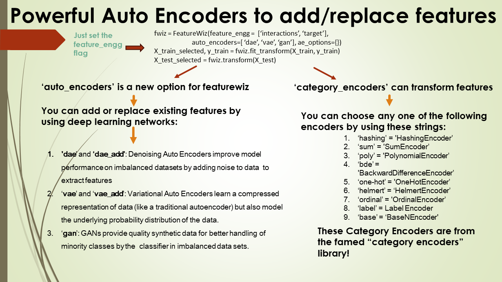

# featurewiz
🔥 FeatureWiz, the ultimate feature selection library is powered by the renowned Minimum Redundancy Maximum Relevance (MRMR) algorithm. Learn more about it below.


# Table of Contents
<ul>
<li><a href="#Latest">Latest updates</a></li>
<li><a href="#citation">Citation</a></li>
<li><a href="#highlights">Hightlights</a></li>
<li><a href="#workings">Workings</a></li>
<li><a href="#usage">Usage</a></li>
<li><a href="#tips">Tips for using featurewiz</a></li>
<li><a href="#install">How to install featurewiz</a></li>
<li><a href="#usage">Usage</a></li>
<li><a href="#api">API</a></li>
<li><a href="#additional">Additional Tips</a></li>
<li><a href="#maintainers">Maintainers</a></li>
<li><a href="#contributing">Contributing</a></li>
<li><a href="#license">License</a></li>
<li><a href="#disclaimer">Disclaimer</a></li>
</ul>

## Latest
`featurewiz` 5.0 version is out! It contains brand new Deep Learning Auto Encoders to enrich your data for the toughest imbalanced and multi-class datasets. In addition, it has multiple brand-new Classifiers built for imbalanced and multi-class problems such as the `IterativeDoubleClassifier` and The `BlaggingClassifier`. If you are looking for the latest and greatest updates about our library, check out our <a href="https://github.com/AutoViML/featurewiz/blob/main/updates.md">updates page</a>.
<br>

## Citation
If you use featurewiz in your research project or paper, please use the following format for citations:<p>
"Seshadri, Ram (2020). GitHub - AutoViML/featurewiz: Use advanced feature engineering strategies and select the best features from your data set fast with a single line of code. source code: https://github.com/AutoViML/featurewiz"</p>
<b>Current citations for featurewiz</b>

[Google Scholar citations for featurewiz](https://scholar.google.com/scholar?hl=en&as_sdt=0%2C31&q=featurewiz&btnG=)

## Highlights
`featurewiz` is the best feature selection library for boosting your machine learning performance with minimal effort and maximum relevance using the famous MRMR algorithm.

### What Makes FeatureWiz Stand Out? 🔍
✔️ Automatically select the most relevant features without specifying a number 
🚀 Fast and user-friendly, perfect for data scientists at all levels 
🎯 Provides a built-in categorical-to-numeric encoder 
📚 Well-documented with plenty of examples 
📝 Actively maintained and regularly updated 

### Simple tips for success using featurewiz 💡
📈 First create additional features using the feature engg module 
🌐 Compare featurewiz against other feature selection methods for best performance
⚖️ Avoid overfitting by cross-validating your results as shown <a href="https://github.com/AutoViML/featurewiz/blob/main/examples/cross_validate.py">here</a>
🎯 Try adding auto-encoders for additional features that may help boost performance

### Feature Engineering
Create new features effortlessly with a single line of code. featurewiz enables you to generate hundreds of interaction, group-by, or target-encoded features, eliminating the need for expert-level skills. 

### What is MRMR?
featurewiz provides one of the best automatic feature selection algorithms, MRMR, described by wikipedia in this page <a href="https://en.wikipedia.org/wiki/Minimum_redundancy_feature_selection"> as follows: "The MRMR feature selection algorithm has been found to be more powerful than the maximum relevance feature selection algorithm"</a> Boruta.

### How does MRMR feature selection work?🔍 
After creating new features, featurewiz uses the MRMR algorithm to answer crucial questions: Which features are important? Are they redundant or multi-correlated? Does your model suffer from or benefit from these new features? To answer these questions, two more steps are needed: ⚙️ SULOV Algorithm: The "Searching for Uncorrelated List of Variables" method ensures you're left with the most relevant, non-redundant features. ⚙️ Recursive XGBoost: featurewiz leverages XGBoost to repeatedly identify the best features among the selected variables after SULOV. 

### Advanced Feature Engineering Options

featurewiz extends beyond traditional feature selection by including powerful feature engineering capabilities such as:
<li>Auto Encoders, including Denoising Auto Encoders (DAEs) Variational Auto Encoders (VAEs), and GANs (Generative Adversarial Networks) for additional feature extraction, especially on imbalanced datasets.</li>
<a href="https://github.com/AutoViML/featurewiz"></a>
<li>A variety of category encoders like HashingEncoder, SumEncoder, PolynomialEncoder, BackwardDifferenceEncoder, OneHotEncoder, HelmertEncoder, OrdinalEncoder, and BaseNEncoder.</li>
<li>The ability to add interaction features (e.g., x1x2, x2x3, x1^2), group by features, and target encoding</li>

### Examples and Updates
- featurewiz is well-documented, and it comes with a number of <a href="https://github.com/AutoViML/featurewiz/tree/main/examples">examples</a>
- featurewiz is actively maintained, and it is regularly updated with <a href="https://github.com/AutoViML/featurewiz/blob/main/updates.md">new features and bug fixes</a>

## Workings
`featurewiz` has two major modules to transform your Data Science workflow:<p>
<b>1. Feature Engineering Module</b>


<li>Advanced Feature Creation: use Deep Learning based Auto Encoders and GAN's to extract features to add to your data. These powerful capabilities will help you in solving your toughest problems.</li>
<li>Options for Enhancement: Use "interactions", "groupby", or "target" flags to enable advanced feature engineering techniques.</li>
<li>Kaggle-Ready: Designed to meet the high standards of feature engineering required in competitive data science, like Kaggle.</li>
<li>Efficient and User-Friendly: Generate and sift through thousands of features, selecting only the most impactful ones for your model.</li><br>



<b>2. Feature Selection Module</b>
<li>MRMR Algorithm: Employs Minimum Redundancy Maximum Relevance (MRMR) for effective feature selection.</li>
<li>SULOV Method: Stands for 'Searching for Uncorrelated List of Variables', ensuring low redundancy and high relevance in feature selection.</li>
<li>Addressing Key Questions: Helps interpret new features, assess their importance, and evaluate the model's performance with these features.</li>
<li>Optimal Feature Subset: Uses Recursive XGBoost in combination with SULOV to identify the most critical features, reducing overfitting and improving model interpretability.</li>

#### Comparing featurewiz to Boruta:
Featurewiz uses what is known as a `Minimal Optimal` algorithm while Boruta uses an `All-Relevant` algorithm. To understand how featurewiz's MRMR approach differs Boruta for comprehensive feature selection you need to see the chart below. It shows how the SULOV algorithm performs <a href="https://towardsdatascience.com/mrmr-explained-exactly-how-you-wished-someone-explained-to-you-9cf4ed27458b">MRMR feature selection</a> which provides a smaller feature set compared to Boruta. Additionally, Boruta contains redundant features (highly correlated features) which will hamper model performance while featurewiz doesn't.


Transform your feature engineering and selection process with featurewiz - the tool that brings expert-level capabilities to your fingertips!

## Working
`featurewiz` performs feature selection in 2 steps. Each step is explained below.
<b>The working of the `SULOV` algorithm</b> is as follows:
<ol>
<li>Find all the pairs of highly correlated variables exceeding a correlation threshold (say absolute(0.7)).</li>
<li>Then find their MIS score (Mutual Information Score) to the target variable. MIS is a non-parametric scoring method. So its suitable for all kinds of variables and target.</li>
<li>Now take each pair of correlated variables, then knock off the one with the lower MIS score.</li>
<li>What’s left is the ones with the highest Information scores and least correlation with each other.</li>
</ol>


<b>The working of the Recursive XGBoost</b> is as follows: 
Once SULOV has selected variables that have high mutual information scores with the least correlation among them, featurewiz uses XGBoost to repeatedly find the best features among the remaining variables after SULOV. 
<ol>
<li>Select all variables in the data set and the full data split into train and valid sets.</li>
<li>Find top X features (could be 10) on train using valid for early stopping (to prevent over-fitting)</li>
<li>Then take the next set of vars and find top X</li>
<li>Do this 5 times. Combine all selected features and de-duplicate them.</li>
</ol>


## Tips
Here are some additional tips for ML engineers and data scientists when using featurewiz:
<ol>
<li><b>How to cross-validate your results</b>: When you use featurewiz, we automatically perform multiple rounds of feature selection using permutations on the number of columns. However, you can perform feature selection using permutations of rows as follows in <a href="https://github.com/AutoViML/featurewiz/blob/main/examples/cross_validate.py">cross_validate using featurewiz.</a>
<li><b>Use multiple feature selection tools</b>: It is a good idea to use multiple feature selection tools and compare the results. This will help you to get a better understanding of which features are most important for your data.</li>
<li><b>Don't forget to use Auto Encoders!</b>: Autoencoders are like skilled artists who can draw a quick sketch of a complex picture. They learn to capture the essence of the data and then recreate it with as few strokes as possible. This process helps in understanding and compressing data efficiently.</li>
<li><b>Don't overfit your model</b>: It is important to avoid overfitting your model to the training data. Overfitting occurs when your model learns the noise in the training data, rather than the underlying signal. To avoid overfitting, you can use regularization techniques, such as lasso or elasticnet.</li>
<li><b>Start with a small number of features</b>: When you are first starting out, it is a good idea to start with a small number of features. This will help you to avoid overfitting your model. As you become more experienced, you can experiment with adding more features.</li>
</ol>

## Install

**Prerequisites:**
<ol>
<li><b>featurewiz is built using xgboost, dask, numpy, pandas and matplotlib</b>. It should run on most Python 3 Anaconda installations. You won't have to import any special libraries other than "dask", "XGBoost" and "networkx" library. Optionally, it uses LightGBM for fast modeling, which it installs automatically. </li>
<li><b>We use "networkx" library for charts and interpretability</b>. <br>But if you don't have these libraries, featurewiz will install those for you automatically.</li>
</ol>
To install from source:

```
cd <featurewiz_Destination>
git clone git@github.com:AutoViML/featurewiz.git
# or download and unzip https://github.com/AutoViML/featurewiz/archive/master.zip
conda create -n <your_env_name> python=3.7 anaconda
conda activate <your_env_name> # ON WINDOWS: `source activate <your_env_name>`
cd featurewiz
pip install -r requirements.txt
```

##  Good News: You can install featurewiz on Colab and Kaggle easily in 2 steps!
As of June 2022, thanks to [arturdaraujo](https://github.com/arturdaraujo), featurewiz is now available on conda-forge. You can try:<br>

```
 conda install -c conda-forge featurewiz
```

### If the above conda install fails, you can try installing featurewiz this way:
#### Install featurewiz using git+<br>

```
!pip install git+https://github.com/AutoViML/featurewiz.git
```

## Usage

There are two ways to use featurewiz. 
<ol>
<li>The first way is the new way where you use scikit-learn's `fit and predict` syntax. It also includes the `lazytransformer` library that I created to transform datetime, NLP and categorical variables into numeric variables automatically. We recommend that you use it as the main syntax for all your future needs.</li>

```
from featurewiz import FeatureWiz
fwiz = FeatureWiz(feature_engg = '', nrows=None, transform_target=True, scalers="std",
        		category_encoders="auto", add_missing=False, verbose=0, imbalanced=False, 
                ae_options={})
X_train_selected, y_train = fwiz.fit_transform(X_train, y_train)
X_test_selected = fwiz.transform(X_test)
### get list of selected features ###
fwiz.features  
```

<li>The second way is the old way and this was the original syntax of featurewiz. It  is still being used by thousands of researchers in the field. Hence it will continue to be maintained. However, it can be discontinued any time without notice. You can use it if you like it.</li>

```
import featurewiz as fwiz
outputs = fwiz.featurewiz(dataname=train, target=target, corr_limit=0.70, verbose=2, sep=',', 
		header=0, test_data='',feature_engg='', category_encoders='',
		dask_xgboost_flag=False, nrows=None, skip_sulov=False, skip_xgboost=False)
```

`outputs` is a tuple: There will always be two objects in output. It can vary:
- In the first case, it can be `features` and `trainm`: features is a list (of selected features) and trainm is the transformed dataframe (if you sent in train only)
- In the second case, it can be `trainm` and `testm`: It can be two transformed dataframes when you send in both test and train but with selected features.

In both cases, the features and dataframes are ready for you to do further modeling.

Featurewiz works on any multi-class, multi-label data Set. So you can have as many target labels as you want.
You don't have to tell Featurewiz whether it is a Regression or Classification problem. It will decide that automatically.

## API

**Input Arguments for NEW syntax**

    Parameters
    ----------
    corr_limit : float, default=0.90
        The correlation limit to consider for feature selection. Features with correlations 
        above this limit may be excluded.

    verbose : int, default=0
        Level of verbosity in output messages.

    feature_engg : str or list, default=''
        Specifies the feature engineering methods to apply, such as 'interactions', 'groupby', 
        and 'target'. 

    auto_encoders : str or list, default=''
        Five new options have been added recently to `auto_encoders` (starting in version 0.5.0): `dae`, `vae`, `dae_add`, `vae_add` and `gan`. These are deep learning auto encoders (using tensorflow and keras) that can extract the most important patterns in your data and either replace your features or add them as extra features to your data. Try them for your toughest ML problems!

    ae_options : dict, default={}
        You can provide a dictionary for tuning auto encoders above. Supported auto encoders include 'dae', 
        'vae', and 'gan'. You must use the `help` function to see how to send a dict to each auto encoder. You can also check out this <a href="https://github.com/AutoViML/featurewiz/blob/main/examples/Featurewiz_with_AutoEncoder_Demo.ipynb">Auto Encoder demo notebook</a>

    category_encoders : str or list, default=''
        Encoders for handling categorical variables. Supported encoders include 'onehot', 
        'ordinal', 'hashing', 'count', 'catboost', 'target', 'glm', 'sum', 'woe', 'bdc', 
        'loo', 'base', 'james', 'helmert', 'label', 'auto', etc.

    add_missing : bool, default=False
        If True, adds indicators for missing values in the dataset.

    dask_xgboost_flag : bool, default=False
        If set to True, enables the use of Dask for parallel computing with XGBoost.

    nrows : int or None, default=None
        Limits the number of rows to process.

    skip_sulov : bool, default=False
        If True, skips the application of the Super Learning Optimized (SULO) method in 
        feature selection.

    skip_xgboost : bool, default=False
        If True, bypasses the recursive XGBoost feature selection.

    transform_target : bool, default=False
        When True, transforms the target variable(s) into numeric format if they are not 
        already.

    scalers : str or None, default=None
        Specifies the scaler to use for feature scaling. Available options include 
        'std', 'standard', 'minmax', 'max', 'robust', 'maxabs'.

    imbalanced : True or False, default=False
        Specifies whether to use SMOTE technique for imbalanced datasets.

**Input Arguments for old syntax**

- `dataname`: could be a datapath+filename or a dataframe. It will detect whether your input is a filename or a dataframe and load it automatically.
- `target`: name of the target variable in the data set.
- `corr_limit`: if you want to set your own threshold for removing variables as highly correlated, then give it here. The default is 0.9 which means variables less than -0.9 and greater than 0.9 in pearson's correlation will be candidates for removal.
- `verbose`: This has 3 possible states:
  - `0` - limited output. Great for running this silently and getting fast results.
  - `1` - verbose. Great for knowing how results were and making changes to flags in input.
  - `2` - more charts such as SULOV and output. Great for finding out what happens under the hood for SULOV method.
- `test_data`: This is only applicable to the old syntax if you want to transform both train and test data at the same time in the same way. `test_data` could be the name of a datapath+filename or a dataframe. featurewiz will detect whether your input is a filename or a dataframe and load it automatically. Default is empty string.
- `dask_xgboost_flag`: default False. If you want to use dask with your data, then set this to True.
- `feature_engg`: You can let featurewiz select its best encoders for your data set by setting this flag
    for adding feature engineering. There are three choices. You can choose one, two, or all three.
    - `interactions`: This will add interaction features to your data such as x1*x2, x2*x3, x1**2, x2**2, etc.
    - `groupby`: This will generate Group By features to your numeric vars by grouping all categorical vars.
    - `target`:  This will encode and transform all your categorical features using certain target encoders.<br>
    Default is empty string (which means no additional features)
- `add_missing`: default is False. This is a new flag: the `add_missing` flag will add a new column for missing values for all your variables in your dataset. This will help you catch missing values as an added signal.
- `category_encoders`: default is "auto". Instead, you can choose your own category encoders from the list below.
    We recommend you do not use more than two of these. Featurewiz will automatically select only two if you have more than two in your list. You can set "auto" for our own choice or the empty string "" (which means no encoding of your categorical features)<br> These descriptions are derived from the excellent <a href="https://contrib.scikit-learn.org/category_encoders/"> category_encoders</a> python library. Please check it out!
    - `HashingEncoder`: HashingEncoder is a multivariate hashing implementation with configurable dimensionality/precision. The advantage of this encoder is that it does not maintain a dictionary of observed categories. Consequently, the encoder does not grow in size and accepts new values during data scoring by design.
    - `SumEncoder`: SumEncoder is a Sum contrast coding for the encoding of categorical features.
    - `PolynomialEncoder`: PolynomialEncoder is a Polynomial contrast coding for the encoding of categorical features.
    - `BackwardDifferenceEncoder`: BackwardDifferenceEncoder is a Backward difference contrast coding for encoding categorical variables.
    - `OneHotEncoder`: OneHotEncoder is the traditional Onehot (or dummy) coding for categorical features. It produces one feature per category, each being a binary.
    - `HelmertEncoder`: HelmertEncoder uses the Helmert contrast coding for encoding categorical features.
    - `OrdinalEncoder`: OrdinalEncoder uses Ordinal encoding to designate a single column of integers to represent the categories in your data. Integers however start in the same order in which the categories are found in your dataset. If you want to change the order, just sort the column and send it in for encoding.
    - `FrequencyEncoder`: FrequencyEncoder is a count encoding technique for categorical features. For a given categorical feature, it replaces the names of the categories with the group counts of each category.
    - `BaseNEncoder`: BaseNEncoder encodes the categories into arrays of their base-N representation. A base of 1 is equivalent to one-hot encoding (not really base-1, but useful), and a base of 2 is equivalent to binary encoding. N=number of actual categories is equivalent to vanilla ordinal encoding.
    - `TargetEncoder`: TargetEncoder performs Target encoding for categorical features. It supports the following kinds of targets: binary and continuous. For multi-class targets, it uses a PolynomialWrapper.
    - `CatBoostEncoder`: CatBoostEncoder performs CatBoost coding for categorical features. It supports the following kinds of targets: binary and continuous. For polynomial target support, it uses a PolynomialWrapper. This is very similar to leave-one-out encoding, but calculates the values “on-the-fly”. Consequently, the values naturally vary during the training phase and it is not necessary to add random noise.
    - `WOEEncoder`: WOEEncoder uses the Weight of Evidence technique for categorical features. It supports only one kind of target: binary. For polynomial target support, it uses a PolynomialWrapper. It cannot be used for Regression.
    - `JamesSteinEncoder`: JamesSteinEncoder uses the James-Stein estimator. It supports 2 kinds of targets: binary and continuous. For polynomial target support, it uses PolynomialWrapper.
    For feature value i, James-Stein estimator returns a weighted average of:
    The mean target value for the observed feature value i.
    The mean target value (regardless of the feature value).
- `nrows`: default `None`. You can set the number of rows to read from your datafile if it is too large to fit into either dask or pandas. But you won't have to if you use dask. 
- `skip_sulov`: default `False`. You can set the flag to skip the SULOV method if you want. 
- `skip_xgboost`: default `False`. You can set the flag to skip the Recursive XGBoost method if you want. 

**Output values for old syntax** This applies only to the old syntax.
-   `outputs`: Output is always a tuple. We can call our outputs in that tuple as `out1` and `out2` below.
    -   `out1` and `out2`: If you sent in just one dataframe or filename as input, you will get:
        - 1. `features`: It will be a list (of selected features) and
        - 2. `trainm`: It will be a dataframe (if you sent in a file or dataname as input)
    -   `out1` and `out2`: If you sent in two files or dataframes (train and test), you will get:
        - 1. `trainm`: a modified train dataframe with engineered and selected features from dataname and
        - 2. `testm`: a modified test dataframe with engineered and selected features from test_data.

## Additional
To learn more about how featurewiz works under the hood, watch this [video](https://www.youtube.com/embed/ZiNutwPcAU0)


featurewiz was designed for selecting High Performance variables with the fewest steps.
In most cases, featurewiz builds models with 20%-99% fewer features than your original data set with nearly the same or slightly lower performance (this is based on my trials. Your experience may vary).<br>

featurewiz is every Data Scientist's feature wizard that will:<ol>
<li><b>Automatically pre-process data</b>: you can send in your entire dataframe "as is" and featurewiz will classify and change/label encode categorical variables changes to help XGBoost processing. It classifies variables as numeric or categorical or NLP or date-time variables automatically so it can use them correctly to model.<br>
<li><b>Perform feature engineering automatically</b>: The ability to create "interaction" variables or adding "group-by" features or "target-encoding" categorical variables is difficult and sifting through those hundreds of new features is painstaking and left only to "experts". Now, with featurewiz you can use deep learning to extract features with the click of a mouse. This is very helpful when you have imbalanced classes or 1000's of features to deal with. However, be careful with this option. You can very easily spend a lot of time tuning these neural networks.
<li><b>Perform feature reduction automatically</b>. When you have small data sets and you know your domain well, it is easy to perhaps do EDA and identify which variables are important. But when you have a very large data set with hundreds if not thousands of variables, selecting the best features from your model can mean the difference between a bloated and highly complex model or a simple model with the fewest and most information-rich features. featurewiz uses XGBoost repeatedly to perform feature selection. You must try it on your large data sets and compare!<br>
<li><b>Explain SULOV method graphically </b> using networkx library so you can see which variables are highly correlated to which ones and which of those have high or low mutual information scores automatically. Just set verbose = 2 to see the graph. <br>
<li><b>Build a fast XGBoost or LightGBM model using the features selected by featurewiz</b>. There is a function called "simple_lightgbm_model" which you can use to build a fast model. It is a new module, so check it out.<br>
</ol>

<b>*** Special thanks to fellow open source Contributors ***</b>:<br>
<ol>
<li><b>Alex Lekov</b> (https://github.com/Alex-Lekov/AutoML_Alex/tree/master/automl_alex) for his DataBunch and encoders modules which are used by the tool (although with some modifications).</li>
<li><b>Category Encoders</b> library in Python : This is an amazing library. Make sure you read all about the encoders that featurewiz uses here: https://contrib.scikit-learn.org/category_encoders/index.html </li>
</ol>

## Maintainers

* [@AutoViML](https://github.com/AutoViML)

## Contributing

See [the contributing file](CONTRIBUTING.md)!

PRs accepted.

## License

Apache License 2.0 © 2020 Ram Seshadri

## DISCLAIMER
This project is not an official Google project. It is not supported by Google and Google specifically disclaims all warranties as to its quality, merchantability, or fitness for a particular purpose.


[page]: examples/cross_validate.py
