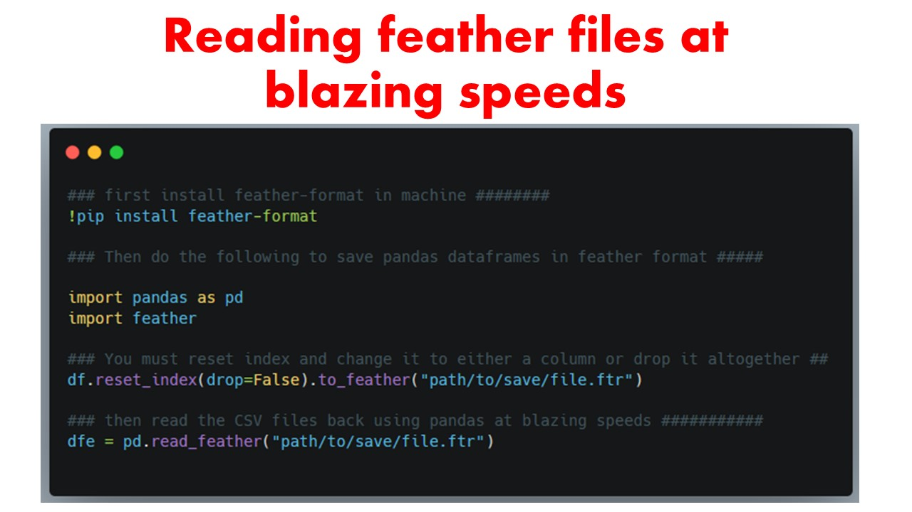

# featurewiz latest updates
This is the main page where we will post the latest updates to the featurewiz library. Make sure you upgrade your featurewiz library everytime you run to take advantage of new features. There are new updates almost every week!

#### Update (December 2023): FeatureWiz 0.5 is here! Includes powerful deep learning autoencoders!
<ol>
<li><b>The FeatureWiz transformer now includes powerful deep learning auto encoders in the `feature_engg` argument. You can set them to `vae` for Variational Auto Encoder, `dae` for Denoising Auto Encoder and `gan` for GAN data augmentation for generating synthetic data. I have uploaded a sample noetbook for you to test and improve your Classifier performance in Imbalanced datasets. Please send me comments via email which is displayed on my Github main page.
</ol>

#### Update (November 2023): The FeatureWiz transformer (version 0.4.3 on) includes an "add_missing" flag
<ol>
<li><b>The FeatureWiz transformer now includes an `add_missing` flag which will add a new column for missing values for all your variables in your dataset.</b> This will help you catch missing values as an added signal when you use FeatureWiz library. Try it out and let us know in your comments via email.
</ol>

#### Update (October 2023): FeatureWiz transformer (version 0.4.0 on) now has lazytransformer library
<ol>
<li><b>The new FeatureWiz transformer includes a categorical encoder + date-time + NLP transfomer that transforms all your string, text, date-time columns into numeric variables in one step.</b> You will see a fully transformed `(all-numeric)` dataset when you use FeatureWiz transformer. Try it out and let us know in your comments via email.
</ol>

#### Update (June 2023): featurewiz now has skip_sulov and skip_xgboost flags
<ol>
<li>There are two flags that are available to skip the recursive xgboost and/or SULOV methods. They are the `skip_xgboost` and `skip_sulov` flags. They are by default set to `False`. But you can change them to `True` if you want to skip them.
</ol>

#### Update (May 2023): featurewiz 3.0 is here with better accuracy and speed
<ol>
<li>The latest version of featurewiz is here!</li> The new 3.0 version of featurewiz provides slightly better performance by about 1-2% in diverse datasets (your experience may vary). Install it and check it out!
</ol>

#### Update (March 2023): XGBoost 1.7 has issues with featurewiz
<ol>
<li>The latest version of XGBoost 1.7+ does not work with featurewiz.</li> 
 They have made massive changes to their API. So please switch to xgboost 1.5 if you want to run featurewiz.</ol>
</ol>

#### Update (October 2022): FeatureWiz 2.0 is here. 
<ol>
<li>featurewiz 2.0 is here. You have two small performance improvements:</li> 
1. SULOV method now has a higher correlation limit of 0.90 as default. This means fewer variables are removed and hence more vars are selected. You can always set it back to the old limit by setting `corr_limit`=0.70 if you want.
<br>
2. Recursive XGBoost algorithm is tighter in that it selects fewer features in each iteration. To see how many it selects, set `verbose` flag to 1. <br>
The net effect is that the same number of features are selected but they are better at producing more accurate models. Try it out and let us know. 
</ol>

#### Update (September 2022): You can now skip SULOV method using skip_sulov flag
<ol>
<li>featurewiz now has a new input: `skip_sulov` flag is here. You can set it to `True` to skip the SULOV method if needed.</li>
</ol>

#### Update (August 2022): Silent mode with verbose=0
<ol>
<li>featurewiz now has a "silent" mode which you can set using the "verbose=0" option. It will run silently with no charts or graphs and very minimal verbose output. Hope this helps!<br></li>
</ol>
#### Update (May 2022): New high performance modules based on XGBoost and LightGBM
<ol>
<li>featurewiz as of version 0.1.50 or higher has multiple high performance models that you can use to build highly performant models once you have completed feature selection. These models are based on LightGBM and XGBoost and have even Stacking and Blending ensembles. You can find them as functions starting with "simple_" and "complex_" under featurewiz. All the best!<br></li>
</ol>
#### Update (March 2022): Ability to read feather format files
<ol>
<li>featurewiz as of version 0.1.04 or higher can read `feather-format` files at blazing speeds. See example below on how to convert your CSV files to feather. Then you can feed those '.ftr' files to featurewiz and it will read it 10-100X faster!<br></li>
</ol>


<ol>
<li>featurewiz now runs at blazing speeds thanks to using GPU's by default. So if you are running a large data set on Colab and/or Kaggle, make sure you turn on the GPU kernels. featurewiz will automatically detect that GPU is turned on and will utilize XGBoost using GPU-hist. That will ensure it will crunch your datasets even faster. I have tested it with a very large data set and it reduced the running time from 52 mins to 1 minute! That's a 98% reduction in running time using GPU compared to CPU!<br></li>
</ol>
## Update (Jan 2022): FeatureWiz is now a sklearn-compatible transformer that you can use in data pipelines
<ol>
<li>FeatureWiz as of version 0.0.90 or higher is a scikit-learn compatible feature selection transformer. You can perform fit and predict as follows. You will get a Transformer that can select the top variables from your dataset. You can also use it in sklearn pipelines as a Transformer.</li>

```
from featurewiz import FeatureWiz
features = FeatureWiz(corr_limit=0.70, feature_engg='', category_encoders='', 
dask_xgboost_flag=False, nrows=None, verbose=2)
X_train_selected = features.fit_transform(X_train, y_train)
X_test_selected = features.transform(X_test)
features.features  ### provides the list of selected features ###
```

<li>Featurewiz is now upgraded with XGBOOST 1.5.1 for DASK for blazing fast performance even for very large data sets! Set `dask_xgboost_flag = True` to run dask + xgboost.</li>
<li>Featurewiz now runs with a default setting of `nrows=None`. This means it will run using all rows. But if you want it to run faster, then you can change `nrows` to 1000 or whatever, so it will sample that many rows and run.</li>
<li>Featurewiz has lots of new fast model builder functions that you can use to build highly performant models with the features selected by featurewiz. They are:<br>
1. <b>simple_LightGBM_model()</b> - simple regression and classification with one target label.<br>
2. <b>simple_XGBoost_model()</b> - simple regression and classification with one target label.<br>
3. <b>complex_LightGBM_model()</b> - more complex multi-label and multi-class models.<br>
4. <b>complex_XGBoost_model()</b> - more complex multi-label and multi-class models.<br>
5. <b>Stacking_Classifier()</b>: Stacking model that can handle multi-label, multi-class problems.<br>
6. <b>Stacking_Regressor()</b>: Stacking model that can handle multi-label, regression problems.<br>
7. <b>Blending_Regressor()</b>: Blending model that can handle multi-label, regression problems.<br></li>
</ol>
